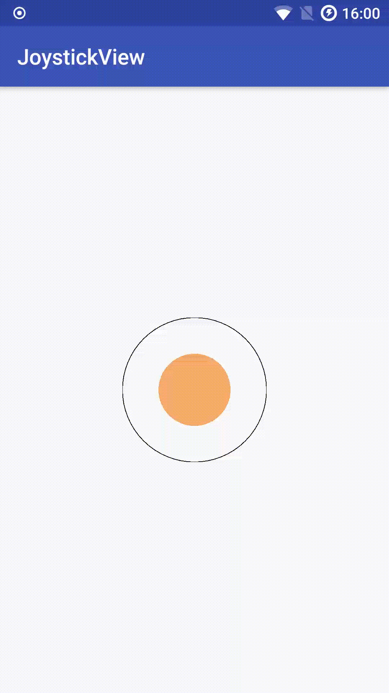
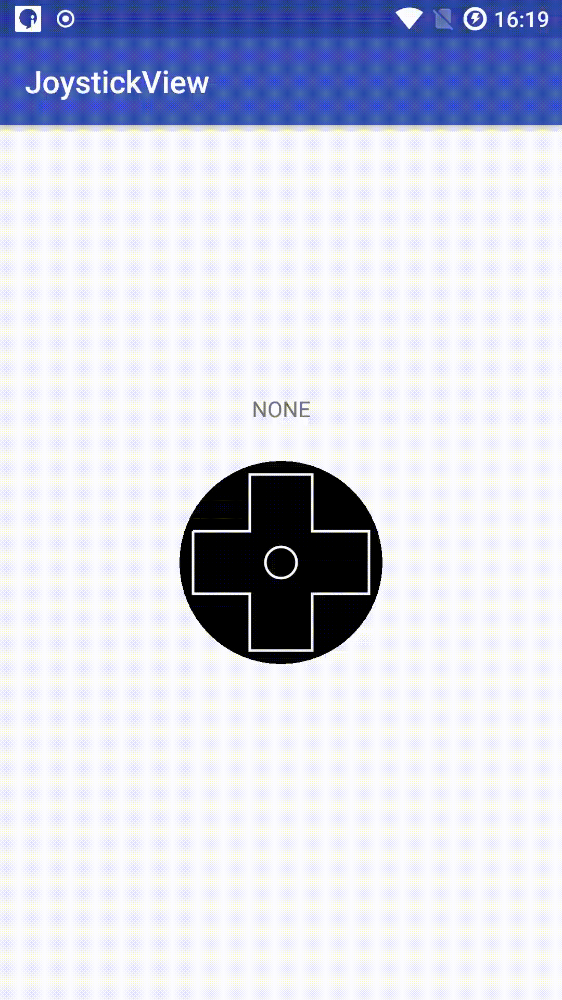

# RockerView

这是一个游戏手柄方向键的自定义View。

  

  

## 开始

Gradle 3.0及以上

```
implementation 'me.caibou.android:rockerview:1.0.0'
```

Gradle 3.0以下

```
compile 'me.caibou.android:rockerview:1.0.0'
```

  

## 使用

### JoystickView

```xml
<me.caibou.rockerview.JoystickView
        android:id="@+id/joystick_control"
        android:layout_width="wrap_content"
        android:layout_height="wrap_content"
        app:layout_constraintBottom_toBottomOf="parent"
        app:layout_constraintEnd_toEndOf="parent"
        app:layout_constraintStart_toStartOf="parent"
        app:layout_constraintTop_toTopOf="parent"
                               
        app:edge_radius="65dp"
        app:stick_color="#f52504"
        />
```

#### 属性

* edge_radius:外边框的半径
* stick_color:摇杆的颜色


#### 设置角度改变回调

```java
joystickView.setAngleUpdateListener(new JoystickView.OnAngleUpdateListener() {
  	@Override
    public void onAngleUpdate(double angle, int action) {
    	if (action == JoystickView.ACTION_RELEASE){
        	tvAngle.setText("");
        } else {
            tvAngle.setText(getString(R.string.angle, angle));
        }
    }
});
```


 

### DirectionView

```xml
<me.caibou.rockerview.DirectionView
        android:id="@+id/direct_control"
        android:layout_width="wrap_content"
        android:layout_height="wrap_content"
        app:layout_constraintEnd_toEndOf="parent"
        app:layout_constraintHorizontal_bias="parent"
        app:layout_constraintStart_toStartOf="parent"
        app:layout_constraintTop_toTopOf="parent"
        
		app:edge_radius="65dp"
        app:button_outside_circle_radius="60dp"
        app:button_side_width="40dp"
		app:indicator_color="#f52504"
		/>
```

#### 属性

* edge_radius:外边框的半径
* button_outside_circle_radius:方向按钮外切圆的半径
* button_side_width:方向按钮的边长
* indicator_color:手指按下之后指示器的颜色


#### 设置方向改变回调

```java
directionView.setDirectionChangeListener(new DirectionView.DirectionChangeListener() {
	@Override
    public void onDirectChange(DirectionView.Direction direction) {
    	tvAngle.setText(direction.toString());
    }
});
```

   

 

## License

```
Copyright 2017 caibou.

Licensed under the Apache License, Version 2.0 (the "License");
you may not use this file except in compliance with the License.
You may obtain a copy of the License at

    http://www.apache.org/licenses/LICENSE-2.0

Unless required by applicable law or agreed to in writing, software
distributed under the License is distributed on an "AS IS" BASIS,
WITHOUT WARRANTIES OR CONDITIONS OF ANY KIND, either express or implied.
See the License for the specific language governing permissions and
limitations under the License.
```
